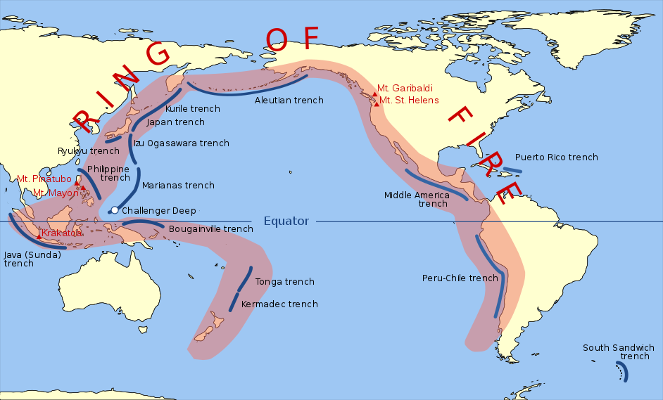

<div align="center">

</div>

> <p dir="RTL"> 
با استفاده از داده های زلزله ها در ایران و جهان به سوالات زیر پاسخ دهید.
</p>

<p dir="RTL">
ابتدا پکیج های مورد نیاز را صدا میزنیم:
</p>
```{r, eval=FALSE}
library(readr)
library(dplyr)
library(plotly)
library(zoo)
library(ggplot2)
library(gganimate)
library(ggthemes)
library(ggmap)
library(animation)
library(highcharter)
library(stringr)
library(PerformanceAnalytics)
library(maps)
library(ggpubr)
```

```{r include=FALSE, cache=FALSE}
library(readr)
library(dplyr)
library(plotly)
library(zoo)
library(ggplot2)
library(gganimate)
library(ggthemes)
library(ggmap)
library(animation)
library(highcharter)
library(stringr)
library(PerformanceAnalytics)
library(maps)
library(ggpubr)
```
***

<h5 dir="RTL">
۱. با استفاده از داده های
historical_web_data_26112015.rds 
و استفاده از نمودار پراکنش سه بعدی بسته plotly نمودار طول، عرض و عمق زلزله ها را رسم نمایید. علاوه بر آن بزرگی هر نقطه را برابر بزرگی زمین لرزه قرار دهید.
</h5>
<h6 dir="RTL">
پاسخ:
</h6>
<p dir="RTL">
ابتدا داده را میخوانیم:
</p>
```{r, warning=FALSE}
historical_data = read_rds("/Users/kayhan/Desktop/data/historical_web_data_26112015.rds")
```
<p dir="RTL">
دو رکورد مربوط به افغانستان و پاکستان را از آن حذف میکنیم تا داده ها کاملا مربوط به ایران باشند:
</p>
```{r, warning=FALSE}
historical_data %>%
  filter(Province!="Afghanistan" & Province!="Pakistan")->historical_data
```
<p dir="RTL">
حالا میتوان نمودار سه بعدی خواسته شده را رسم کرد:
</p>
```{r, warning=FALSE}
plot_ly(historical_data, x = ~Longitude, y = ~Latitude, z = ~Depth, size=~Magnitude, color=~Province,
        marker = list(symbol = 'circle', sizemode = 'diameter'), sizes = c(5, 30))
```
<p dir="RTL">
همانطور که مشخص است، طول و عرض و ارتفاع نمودار متعلق به طول جغرافیایی و عرض جغرافیایی و عمق زلزله است و شدت زلزله هم برابر با اندازه ی هر نقطه میباشد.
</p>
***

<h5 dir="RTL">
۲. پویانمایی سونامی های تاریخی را بر حسب شدت بر روی نقشه زمین رسم نمایید.(از داده زلزله های بزرگ استفاده نمایید.)
</h5>
<h6 dir="RTL">
پاسخ:
</h6>
<p dir="RTL">
ابتدا داده را میخوانیم:
</p>
```{r, warning=FALSE}
disasters = read_delim("/Users/kayhan/Desktop/data/disaster.txt", delim = "\t")
```
<p dir="RTL">
سپس رکوردهای مربوط به سونامی را از آن جدا میکنیم:
</p>
```{r, warning=FALSE}
disasters %>%
  filter(FLAG_TSUNAMI=="Tsu") %>%
  select(Year=YEAR, Latitude=LATITUDE, Longitude=LONGITUDE, COUNTRY, Magnitude=EQ_PRIMARY) %>%
  na.omit()-> Tsunamis
```
<p dir="RTL">
مشخصه های عددی را از کاراکتر به عدد تبدیل میکنیم:
</p>
```{r, warning=FALSE}
Tsunamis$Year=as.numeric(Tsunamis$Year)
Tsunamis$Latitude=as.numeric(Tsunamis$Latitude)
Tsunamis$Longitude=as.numeric(Tsunamis$Longitude)
Tsunamis$Magnitude=as.numeric(Tsunamis$Magnitude)
```
<p dir="RTL">
تمام سونامی های تاریخ روی نقشه به شکل زیر هستند:
</p>
```{r, warning=FALSE, dpi=300}
world = map_data("world")
ggplot()+ 
  geom_polygon(aes(x=world$long, y=world$lat, group=world$group), fill="white", color="lightblue") +
  geom_point(data=Tsunamis, aes(x=Longitude, y=Latitude, size=Magnitude), color="red") + 
  xlab("Longitude") + 
  ylab("Latitude") +
  coord_fixed(1.3) + 
  scale_size(range = c(0.01,2)) +
  theme_map()
```
<p dir="RTL">
میتوان داده ها را برحسب سال، پویانمایی کرد. مثلا سونامی هایی که از سال ۲۰۰۰ به بعد اتفاق افتاده را برحسب سال فریم بندی کرد و در یک انیمیشن نشان داد:
</p>
```{r, message = FALSE, warning = FALSE, fig.show = "false", dpi=300}
Tsunamis %>%
  filter(Year>=2000) %>%
  arrange(Year) -> Tsunamis

ggplot()+ 
  geom_polygon(aes(x=world$long, y=world$lat, group=world$group), fill="white", color="lightblue") +
  geom_point(data=Tsunamis, aes(x=Longitude, y=Latitude, frame=Year, size=Magnitude), color="red") + 
  xlab("Longitude") + 
  ylab("Latitude") +
  coord_fixed(1.3) + 
  scale_size(range = c(1,5)) +
  theme_solarized() -> p
gganimate(p, ani.width=1200, ani.height=900, "images/output.gif")
```


***

<h5 dir="RTL">
۳. نمودار چگالی دو بعدی زلزله های تاریخی ایران را رسم کنید.( از داده iran_earthquake.rds و لایه stat_density_2d استفاده نمایید).
</h5>
<h6 dir="RTL">
پاسخ:
</h6>
<p dir="RTL">
ابتدا داده را میخوانیم:
</p>
```{r, warning=FALSE}
iran_earthquake = read_rds("/Users/kayhan/Desktop/data/iran_earthquake.rds")
```
<p dir="RTL">
سپس نقشه را میخوانیم:
</p>
```{r, warning=FALSE}
myMap = read_rds("/Users/kayhan/Desktop/data/Tehrn_map_6.rds")
```
<p dir="RTL">
پراکنش زلزله های ایران به این صورت بوده است:
</p>
```{r, warning=FALSE, dpi=300}
ggmap(myMap) + 
  geom_point(data=iran_earthquake, aes(x = Long, y = Lat),
             size=0.05, alpha=0.1, color="red")+
  theme_map()
```
<p dir="RTL">
نمودار چگالی دوبعدی زلزله ها هم به این صورت است:
</p>
```{r, warning=FALSE, dpi=300}
ggmap(myMap) + 
  stat_density_2d(data=iran_earthquake, aes(x = Long, y = Lat, fill = ..level..),
                  geom = "polygon", contour=T, alpha=0.7)+
  geom_density2d(data=iran_earthquake, aes(x = Long, y = Lat), alpha=0.7)+
  scale_fill_distiller(palette = "Spectral")+
  theme_map()
```

***

<h5 dir="RTL">
۴. احتمال اینکه در ایران در پنج سال آینده زلزله به بزرگی هفت ریشتر رخ دهد را محاسبه کنید. (از احتمال شرطی استفاده کنید.)
</h5>
<h6 dir="RTL">
پاسخ:
</h6>
<p dir="RTL">
بیایید ابتدا به توزیع شدت زمین لرزه ها نگاه بیندازیم:
</p>
```{r, warning=FALSE}
iran_earthquake %>%
  filter(!is.na(Mag))->tmp

hchart(density(tmp$Mag, na.rm = T), type = "area", name = "Magnitude") %>%
  hc_xAxis(title = list(text = "Magnitude")) %>%
  hc_yAxis(title = list(text = "Density")) %>%
  hc_add_theme(hc_theme_ffx())
```
<p dir="RTL">
این توزیع هرچند نرمال به نظر میرسد، اما نرمال نیست! این حقیقت را میتوان هم از روی نمودار 
QQ-Plot 
فهمید و هم از روی آزمون فرض نرمالیتی:
</p>
```{r, warning=FALSE, dpi=300}
ggqqplot(tmp$Mag)

a = sample(tmp$Mag, 5000)
shapiro.test(a)
```
<p dir="RTL">
بنابراین برای اینکه میزان وقوع زلزله را به شدت زلزله در یک منطقه مرتبط کنیم، از قانون گوتنبرگ-ریشتر استفاده میکنیم. بنابر این قانون، اگر شدت وقوع زمین لرزه را با 
M 
و تعداد زمین لرزه هایی با شدت بیشتر از 
M 
را با 
N 
نشان دهیم، خواهیم داشت
</p>
$$N=10^{a-bM}$$
<p dir="RTL">
که 
a 
و 
b 
ثوابت زلزله شناختی هستند و برای هر منطقه و در هر دوره ای متفاوت اند و باید از روی داده ها محاسبه شوند. دوره ی سال های پس از ۲۰۱۰ 
را اگر انتخاب کنیم:
</p>
```{r, warning=FALSE}
iran_earthquake %>%
  filter(format(as.Date(OriginTime, format="%Y-%m-%d %H:%M:%S"),"%Y")>=2010) -> iran
```
<p dir="RTL">
مدت فاصله بین اولین زلزله ثبت شده و آخرین زلزله ثبت شده در این بازه برحسب سال برابر است با:
</p>
```{r, warning=FALSE}
duration = difftime(max(iran$OriginTime, na.rm = T),
                    min(iran$OriginTime, na.rm = T),
                    units = "week")
duration = as.numeric(duration)/52.25
duration
```
<p dir="RTL">
اگر نمودار گوتنبرگ-ریشتر را برای ایران رسم کنیم:
</p>
```{r, warning=FALSE, dpi=300}
iran %>%
  group_by(Mag) %>%
  summarise(n=n()) %>%
  na.omit() %>%
  arrange(-Mag) %>%
  mutate(N=cumsum(n)/duration, logN=log10(N)) %>%
  filter(Mag>=3 & Mag<=7)-> tmp

ggplot(tmp, aes(x=Mag, y=N))+
  geom_point() +
  xlab("Magnitude") + 
  ylab("Number of Occurance per Year")+
  theme_bw()
```
<p dir="RTL">
حالا اگر محور 
y 
را لگاریتمی کنیم، باید یک خط بر داده ها برازش شود:
</p>
```{r, warning=FALSE, dpi=300}
iran %>%
  group_by(Mag) %>%
  summarise(n=n()) %>%
  na.omit() %>%
  arrange(-Mag) %>%
  mutate(N=cumsum(n)/duration, logN=log10(N)) %>%
  filter(Mag>=3 & Mag<=7)-> tmp

ggplot(tmp, aes(x=Mag, y=N))+
  geom_smooth(method = "lm")+
  geom_point() +
  scale_y_log10()+
  xlab("Magnitude") + 
  ylab("Number of Occurance per Year")+
  theme_bw()
```
<p dir="RTL">
که این امر به خوبی مشهود است.
</p>
<p dir="RTL">
حالا کافی است به این داده ها خطی فیت کنیم تا ضرایب 
a 
و 
b 
برای ایران پس از ۲۰۱۰ معلوم شود:
</p>
```{r, warning=FALSE}
model = lm(logN~Mag, data=tmp)
```
<p dir="RTL">
ضریب 
a 
برابر است با:
</p>
```{r, warning=FALSE}
as.numeric(model$coefficients[1])
```
<p dir="RTL">
و ضریب 
b 
هم برابر است با:
</p>
```{r, warning=FALSE}
-as.numeric(model$coefficients[2])
```
<p dir="RTL">
حالا اگر فرض کنیم که توزیع زمانی وقوع زلزله های مکرر از توزیع پوآسون پیروی میکنند و قانون گوتنبرگ-ریشتر هم برقرار باشد، مدت زمان لازم برای وقوع یک زلزله به قدرت 
y 
ریشتر به طور میانگین برابر است با:
</p>
$$Time(y)=\alpha^{-1}e^{\beta y}$$
<p dir="RTL">
که آلفا میانگین تعداد وقوع زلزله در سال است و بتا هم میانگین شدت هر زلزله میباشد و برابر است با:
</p>

$$\beta = ln(10)\times b$$
<p dir="RTL">
همچنین احتمال وقوع زلزله ای با شدت 
y 
ریشتر پس از 
D 
سال از وقوع آخرین زلزله ی 
y 
ریشتری، برابر است با:
</p>
$$R_D(y)=1-e^{-\alpha D e^{-\beta y}}$$
<p dir="RTL">
در خصوص یافتن راه حل استخراج این معادلات میتوانید به مراجع زیر مراجعه کنید:
</p>
<p>
[1- An Introduction to Probabilistic Seismic
Hazard Analysis (PSHA)](https://web.stanford.edu/~bakerjw/Publications/Baker_(2008)_Intro_to_PSHA_v1_3.pdf)
</p>
<p>
[2- Forecasting Earthquakes - Earthquake Recurrence](http://www.ucl.ac.uk/EarthSci/people/sammonds/19%20Earthquake%20Recurrence.pdf)
</p>
<p dir="RTL">
حال به کد بازگردیم! میتوان آلفا و بتا را مطابق آنچه گفته شد محاسبه کرد:
</p>
```{r, warning=FALSE}
alpha = nrow(iran)/duration
beta = -as.numeric(model$coefficients[2])*log(10)
```
<p dir="RTL">
توابع 
R 
و 
Time 
را هم پیاده سازی کرد:
</p>
```{r, warning=FALSE}
R = function(M,D)
{
  x=exp(-beta*M)
  y=exp(-alpha*D*x)
  return(1-y)
}

Time = function(M)
{
  x=exp(beta*M)
  y=1/alpha
  return(x*y)
}
```
<p dir="RTL">
حالا میتوان به محاسبه ی موارد خواسته شده پرداخت. مثلا امید ریاضی زمان انتظار بین وقوع دو زلزله ی بیشتر از ۷ ریشتری، برابر است با:
</p>
```{r, warning=FALSE}
Time(7)
```
<p dir="RTL">
یعنی حدودا هر ۳۲۳ سال یکبار باید همچین زلزله ای رخ دهد.
</p>
<p dir="RTL">
از زمان وقوع آخرین زلزله ی بیشتر از ۷ ریشتر به چه اندازه میگذرد؟
</p>

```{r, warning=FALSE}
iran %>%
  filter(Mag>=7) -> tmp

gap = as.numeric(difftime(Sys.time(), max(tmp$OriginTime), units = "week"))/52.25

gap
```
<p dir="RTL">
اگر بخواهیم بدانیم احتمال اینکه در ۵ سال آینده زلزله ای به بزرگی ۷ ریشتر به وقوع می پیوندد یا نه چقدر است، باید احتمال شرطی حساب کنیم. فرض کنیم از آخرین زلزله ای با این شدت 
t 
سال گذشته باشد. باید احتمال اینکه طی 
$t+5$ 
سال پس از آخرین زلزله ۷ ریشتری، مجددا زلزله ای با این شدت رخ دهد، به شرط اینکه در 
t 
سال اول رخ ندهد، برابر است با:
</p>
```{r, warning=FALSE}
R(7, gap+5) - R(7, gap)
```
***

<h5 dir="RTL">
۵. بر اساس داده های زلزله های بزرگ ابتدا تعداد و متوسط کشته زلزله ها را بر حسب کشور استخراج نمایید. سپس نمودار گرمایی تعداد کشته ها را بر روی کره زمین رسم نمایید.
</h5>
<h6 dir="RTL">
پاسخ:
</h6>
<p dir="RTL">
ابتدا ستون های مورد نیاز از داده را جدا میکنیم:
</p>
```{r, warning=FALSE}
disasters %>%
  select(YEAR, COUNTRY, DEATHS) %>%
  na.omit()-> tmp
```
<p dir="RTL">
ستون های عددی را از کاراکتر به عدد تبدیل میکنیم:
</p>
```{r, warning=FALSE}
tmp$YEAR=as.integer(tmp$YEAR)
tmp$DEATHS=as.integer(tmp$DEATHS)
```
<p dir="RTL">
به ازای هر کشور، مجموع و میانگین کشته های حاصل از زلزله اش را پیدا میکنیم:
</p>
```{r, warning=FALSE}
tmp %>%
  group_by(COUNTRY) %>%
  summarise(total = sum(DEATHS), mean=mean(DEATHS)) -> tmp
```
<p dir="RTL">
نقشه ی دنیا را از پکیج های چارتر دانلود میکنیم:
</p>
```{r, warning=FALSE}
get_data_from_map(download_map_data("custom/world-eckert3")) %>% 
  select(code = `hc-key`, COUNTRY=name) %>% 
  mutate(COUNTRY = toupper(COUNTRY)) -> data_fake
```
<p dir="RTL">
نام برخی از کشورها در داده با نام کشورها در فایل نقشه همخوانی ندارد. سعی میکنیم این نام ها را در داده اصلاح کنیم:
</p>
```{r, warning=FALSE}
tmp %>%
  mutate(COUNTRY = str_replace(COUNTRY, "BOSNIA-HERZEGOVINA","BOSNIA AND HERZEGOVINA")) %>%
  mutate(COUNTRY = str_replace(COUNTRY, "CONGO","REPUBLIC OF CONGO")) %>%
  mutate(COUNTRY = str_replace(COUNTRY, "SERBIA","REPUBLIC OF SERBIA")) %>%
  mutate(COUNTRY = str_replace(COUNTRY, "TANZANIA","UNITED REPUBLIC OF TANZANIA")) %>%
  mutate(COUNTRY = str_replace(COUNTRY, "UK$","UNITED KINGDOM")) %>%
  mutate(COUNTRY = str_replace(COUNTRY, "USA","UNITED STATES OF AMERICA")) %>%
  mutate(COUNTRY = str_replace(COUNTRY, "MYANMAR (BURMA)","MYANMAR")) ->tmp
```
<p dir="RTL">
داده ی مربوط به میانگین و مجموع افراد کشته شده ی هر کشور را با فایل اسامی کشورهای نقشه ادغام میکنیم:
</p>
```{r, warning=FALSE}
data=left_join(data_fake, tmp)
```
<p dir="RTL">
به ازای داده های ناموجود، عدد منفی یک وارد میکنیم:
</p>
```{r, warning=FALSE}
data$total=na.fill(data$total,-1) 
data$mean=na.fill(data$mean,-1) 
```
<p dir="RTL">
و در نهایت میتوانیم نقشه ی گرمایی را رسم کنیم. برای میانگین کشته ها در هر کشور:
</p>
```{r, warning=FALSE}
hcmap("custom/world-eckert3", data = data, value = "mean",
      joinBy = c("hc-key", "code"), name = "Average Deaths",
      dataLabels = list(enabled = F, format = '{point.name}'),
      borderColor = "#FAFAFA", borderWidth = 0.1) %>%
    hc_mapNavigation(enabled = TRUE) %>%
  hc_add_theme(hc_theme_ffx())
```
<p dir="RTL">
و در نهایت، مجموع کشته های هر کشور در زلزله ها:
</p>
```{r, warning=FALSE}
hcmap("custom/world-eckert3", data = data, value = "total",
      joinBy = c("hc-key", "code"), name = "Total Deaths",
      dataLabels = list(enabled = F, format = '{point.name}'),
      borderColor = "#FAFAFA", borderWidth = 0.1) %>%
    hc_mapNavigation(enabled = TRUE) %>%
  hc_add_theme(hc_theme_ffx())
```
<p dir="RTL">
توجه کنید که کشورهایی که مقادیری برابر با 
$-1$ 
دارند، به این معنی است که داده ی مربوط به آنها موجود نبوده است.
</p>
***

<h5 dir="RTL">
۶. با استفاده از داده لرزه های بزرگ و به وسیله طول، عرض، شدت، عمق مدلی برای پیش بینی تعداد کشته های زلزله بیابید.
</h5>
<h6 dir="RTL">
پاسخ:
</h6>
<p dir="RTL">
ابتدا داده های موجود را مرتب میکنیم و ستون های عددی را از کاراکتر به عدد تبدیل میکنیم:
</p>
```{r, warning=FALSE}
disasters %>%
  select(Longitude=LONGITUDE, Latitude=LATITUDE, Magnitude=EQ_PRIMARY, Depth=FOCAL_DEPTH, Deaths=DEATHS) %>%
  na.omit()-> data

data$Longitude=as.numeric(data$Longitude)
data$Latitude=as.numeric(data$Latitude)
data$Magnitude=as.numeric(data$Magnitude)
data$Deaths=as.integer(data$Deaths)
```
<p dir="RTL">
نمودار پراکنش دو به دوی متغیرها به این صورت است:
</p>
```{r, warning=FALSE, dpi=300}
chart.Correlation(data, histogram=TRUE)
```
<p dir="RTL">
داده ها را به ۵ قسمت تقسیم میکنیم و روی ۴ قسمت آن مدل خود را میسازیم:
</p>
```{r, warning=FALSE}
mydata = split(data, sample(1:5, nrow(data), replace=T))
tmp = mydata[1:4]
train = do.call("rbind", tmp)
model = lm(data = train, Deaths ~ Longitude + Depth + (Latitude + Magnitude )^2  + I(Magnitude^2))
summary(model)
```
<p dir="RTL">
نمودارهای نقص یابی مدل به این صورت هستند:
</p>
```{r, warning=FALSE, dpi=300}
par(mfrow=c(2,2))
plot(model)
```
<p dir="RTL">
همانطور که مشخص است، مدل بسیار ایراد دارد و اصلا مدل خوبی نیست. از آنجا که در مدل، توان های بالاتر و حتی برخورد متغیرهای خواسته شده هم لحاظ شده است، به نظر میرسد با چهار متغیر طول و عرض و عمق و شدت، نمیتوان تعداد کشته ها را پیش بینی کرد. اما بیایید ادامه بدهیم. روی یک پنجم داده ی باقی مانده، مدل خود را تست میکنیم:
</p>
```{r, warning=FALSE}
tmp = mydata[5]
test = do.call("rbind", tmp)
test$PredictDeaths = predict(model, test)
test %>%
  mutate(error = (PredictDeaths-Deaths)/Deaths, absError = abs(error)) -> test
```
<p dir="RTL">
هیستوگرام میزان خطاها بدین صورت است:
</p>
```{r, warning=FALSE}
hchart(density(test$absError), type = "area", name = "Error") %>% 
  hc_xAxis(title = list(text = "Error")) %>%
  hc_add_theme(hc_theme_ffx())
```
<p dir="RTL">
همانطور که مشخص است، خطاهای بسیار زیادی هم در پیش بینی ما رخ میدهند. میانگین کل خطاها برابر است با:
</p>
```{r, warning=FALSE}
mean(test$absError)
```
<p dir="RTL">
و انحراف معیار آن برابر است با:
</p>
```{r, warning=FALSE}
sd(test$absError)
```
<p dir="RTL">
همانطور که گفته شد، مدل بسیار نامطلوب است و به نطر میرسد مدلی بهتر از این، با متغیرهای گفته شده نمیتوان ساخت.
</p>
***

> <h5 dir="RTL"> 
با استفاده از داده 
worldwide.csv 
به چند سوال زیر پاسخ دهید.
</h5>

<p dir="RTL">
ابتدا داده را میخوانیم:
</p>
```{r, warning=FALSE}
worldwide = read_csv("/Users/kayhan/Desktop/data/worldwide.csv")
```
***

<h5 dir="RTL">
۷- آیا میتوان از پیش لرزه، زلزله ی اصلی را پیش بینی کرد؟
</h5>

<h6 dir="RTL">
پاسخ:
</h6>

<p dir="RTL"> 
با یک رویکرد احتمالاتی به این سوال جواب میدهیم. ابتدا همه ی داده های مربوط به زلزله را میگیریم. به ازای هر مکان، فاصله ی هر زلزله از زلزله ی بعدی در همان مکان را حساب میکنیم:
</p>
```{r, warning=FALSE}
worldwide %>%
  select(time, mag, place) %>%
  na.omit() %>%
  group_by(place) %>%
  mutate(nextEarthquakeIn = lead(time)-time) %>%
  ungroup() -> tmp
```
<p dir="RTL"> 
بیایید به تابع توزیع زمان بین زلزله ها نگاه کنیم:
</p>
```{r, warning=FALSE, dpi=300}
ggplot(tmp) + 
  geom_freqpoly(aes(x=nextEarthquakeIn, y=..density..)) +
  xlab("Time of Next Earthquake (Second)") + 
  ylab("Density")+
  theme_bw()
```
<p dir="RTL"> 
به نظر می آید که زمان بین زلزله ها از یک قانون توانی (
Power-Law
) 
پیروی میکند. در این صورت اگر نمودار لگاریتمی آن را بکشیم، باید بر روی یک خط فیت شود. نمودار 
log-log 
این تابع توزیع به صورت زیر است:
</p>
```{r, warning=FALSE, dpi=300}
tmp %>%
  select(nextEarthquakeIn) %>%
  na.omit() %>%
  arrange(nextEarthquakeIn) %>%
  mutate(binNo = as.integer(nextEarthquakeIn/60)*60+30)%>%
  group_by(binNo) %>%
  summarise(n=n()) %>%
  group_by(n) %>%
  summarise(Next = mean(binNo)) %>%
  mutate(Prob = n/sum(n)) -> nextEarthquakeIn

ggplot(nextEarthquakeIn, aes(x=Next, y=Prob))+
  scale_x_log10() + 
  scale_y_log10() +
  geom_smooth(method = "lm") +
  geom_point() + 
  xlab("Time of Next Earthquake (Second)") + 
  ylab("Density")+
  theme_bw()
```
<p dir="RTL"> 
که به خوبی به یک خط فیت شده است.
</p>
<p dir="RTL"> 
احتمال اینکه به ازای یک زلزله، بین 
$t_0$ 
تا 
$t_1$ 
ثانیه بعدش زلزله بی آید، با کم کردن احتمال تجمعی آنها قابل محاسبه است. ابتدا احتمال تجمعی زمان وقوع زلزله ی بعدی به ازای هر زلزله را حساب میکنیم:
</p>
```{r, warning=FALSE}
tmp %>%
  select(nextEarthquakeIn) %>%
  na.omit() %>%
  arrange(nextEarthquakeIn) %>%
  mutate(Next = as.integer(nextEarthquakeIn/60)*60+30)%>%
  group_by(Next) %>%
  summarise(n=n()) %>%
  mutate(CumProb=cumsum(n)/sum(n))-> tmp2
```
<p dir="RTL"> 
نمودار احتمال تجمعی به این صورت است:
</p>
```{r, warning=FALSE, dpi=300}
ggplot(tmp2, aes(x=Next, y=CumProb))+
  geom_line() +
  xlab("Time of Next Earthquake (Second)") + 
  ylab("Cumulative Probability")+
  theme_bw()
```
<p dir="RTL"> 
حالا میتوانیم تابعی بنویسیم که با دریافت دو نقطه ی زمانی، احتمال وقوع زلزله پس از یک زلزله را بین آن دو نقطه ی زمانی به ما بدهد:
</p>
```{r, warning=FALSE}
probForecast = function(min, max)
{
  tmp2 %>%
    filter(Next<max & Next>=min) -> x
  a = max(x$CumProb)-min(x$CumProb)
  return(a)
}
```
<p dir="RTL"> 
تابع ما آماده است! مثلا اگر در نقطه ای، زمین لرزه ای رخ دهد، احتمال اینکه تا ۱ روز پس از آن مجددا زمین لرزه ای رخ دهد برابر است با:
</p>
```{r, warning=FALSE}
probForecast (0, 24*60*60)
```
<p dir="RTL"> 
یا مثلا احتمال اینکه بین ۱ تا ۲ روز پس از آن مجددا زمین لرزه ای رخ بدهد برابر است با:
</p>
```{r, warning=FALSE}
probForecast (24*60*60, 2*24*60*60)
```
***

<h5 dir="RTL">
۸. گزاره " آیا شدت زلزله به عمق آن بستگی دارد" را تحقیق کنید؟ (طبیعتا از آزمون فرض باید استفاده کنید.)
</h5>
<h6 dir="RTL">
پاسخ:
</h6>
<p dir="RTL"> 
ابتدا داده را مرتب میکنیم:
</p>
```{r, warning=FALSE}
worldwide %>%
  select(mag, depth) %>%
  na.omit() -> data
```
<p dir="RTL"> 
نمودار پراکنش شدت زلزله برحسب عمق آن به صورت زیر است:
</p>
```{r, warning=FALSE, dpi=300}
ggplot(data, aes(x=depth, y=mag))+
  geom_point() + 
  theme_bw()
```
<p dir="RTL"> 
از این نمودار چیز زیادی مشخص نیست. به نظر میرسد هرچه عمق زلزله بیشتر شود، اندازه ی آن هم به طور میانگین بیشتر است. برای درک بهتر نمودار، بهتر است با نقاط کمتری کار کنیم. بدین صورت که محور افقی (عمق زلزله) را بین-بندی میکنیم و میانگین هر بین را به عنوان نماینده ی آن بین در نظر میگیریم. برای مثال میتوان هر ۱۰ واحد را یک بین در نظر گرفت و میانگین آن را حساب کرد:
</p>
```{r, warning=FALSE, dpi=300}
data %>%
  mutate(Depth=as.integer(depth/10)) %>%
  group_by(Depth) %>%
  summarise(Mag = mean(mag)) %>%
  mutate(Depth = 10*Depth)-> data2

ggplot(data2, aes(x=Depth, y=Mag))+
  geom_point() + 
  geom_smooth() +
  theme_bw()
```
<p dir="RTL"> 
همانطور که گفته شد، به نظر میرسد هرچه عمق زلزله بیشتر میشود، اندازه ی آن نیز به لحاظ آماری افزایش می یابد (هرچند پراکندگی اش بسیار زیاد است). برای سنجش آماری این موضوع، از آزمون فرض 
Pearson-Correlation-Test 
استفاده میکنیم تا ببینیم آیا بین عمق و اندازه، همبستگی وجود دارد یا خیر:
</p>
```{r, warning=FALSE}
cor.test(data$mag, data$depth, method="pearson")
```
<p dir="RTL"> 
از آنجا که 
p-value 
خیلی پایین است، فرض صفر (که همبستگی آنها ۰ باشد) رد میشود و فرض جایگزین (که بین دو متغیر همبستگی وجود دارد) پذیرفته میشود.
</p>
***

<h5 dir="RTL"> 
۹. میانگین سالانه زلزله ها را بر حسب کشور به دست آورید. آیا میتوان دلیلی در تایید یا رد تئوری هارپ ارائه کرد.
</h5>
<h6 dir="RTL">
پاسخ:
</h6>

<p dir="RTL"> 
ابتدا داده های زلزله را جدا میکنیم:
</p>
```{r, warning=FALSE}
worldwide %>%
  filter(type=="earthquake") -> data
```
<p dir="RTL"> 
با استفاده از کتابخانه ی 
maps 
سعی میکنیم از روی طول و عرض جغرافیایی، کشور محل وقوع زلزله را پیدا کنیم:
</p>
```{r, warning=FALSE}
data %>%
  mutate(COUNTRY = str_to_upper(map.where(database="world", longitude, latitude))) -> data
```
<p dir="RTL"> 
ردیف هایی که این بسته نتوانسته کشورش را تشخیص دهد را جدا میکنیم:
</p>
```{r, warning=FALSE}
data %>%
  filter(is.na(COUNTRY))-> data2

data %>%
  filter(!is.na(COUNTRY))-> data
```
<p dir="RTL"> 
از روی ستون 
place 
سعی میکنیم کشور این ردیف ها را دریابیم. نام کشور معمولا پس از یک ویرگول درج شده است:
</p>
```{r, warning=FALSE}
data2 %>%
  mutate(COUNTRY = str_to_upper(str_sub(place, str_locate(place, ",")[,1]+2, 100 ))) -> data2
```
<p dir="RTL"> 
حالا هر دو بخش از داده ها را با هم ترکیب میکنیم:
</p>
```{r, warning=FALSE}
data = rbind(data, data2)
```
<p dir="RTL"> 
سال وقوع زمین لرزه ها را از روی ستون 
time 
استخراج میکنیم:
</p>
```{r, warning=FALSE}
data %>%
  mutate(Year=format(as.Date(time, format="%Y-%m-%d %H:%M:%S"),"%Y")) -> data
```
<p dir="RTL"> 
زمان اولین زلزله ی ثبت شده در داده ها:
</p>
```{r, warning=FALSE}
min(worldwide$time)
```
<p dir="RTL"> 
و زمان آخرین زلزله ی ثبت شده در داده ها:
</p>
```{r, warning=FALSE}
max(worldwide$time)
```
<p dir="RTL"> 
ستونهای مورد نیاز را از داده جدا کرده و داده های مربوط به یک دوره یکساله (مثلا ۲۰۱۷) را برمیگزینیم:
</p>
```{r, warning=FALSE}
data %>%
  select(Year, COUNTRY, mag) %>%
  filter(Year==2017) %>%
  na.omit() -> data
```
<p dir="RTL"> 
نام برخی کشورها در داده، مطابق آنچه که ورودی نقشه است نیست. به صورت دستی سعی به اصلاح آنها میکنیم:
</p>
```{r, warning=FALSE}
data %>%
  mutate(COUNTRY = str_replace(COUNTRY, "USA.*","UNITED STATES OF AMERICA")) %>%
  mutate(COUNTRY = str_replace(COUNTRY, "TAJIKISTAN.*","TAJIKISTAN")) %>%
  mutate(COUNTRY = str_replace(COUNTRY, "TANZANIA","UNITED REPUBLIC OF TANZANIA")) %>%
  mutate(COUNTRY = str_replace(COUNTRY, "UK:.*","UNITED KINGDOM")) -> data
```
<p dir="RTL"> 
برای هر کشور، تعداد زلزله ها و میانگین شدت زلزله هایش را حساب میکنیم:
</p>
```{r, warning=FALSE}
data %>%
  group_by(COUNTRY) %>%
  summarise(N=n(), AvgMag=mean(mag))->data
```
<p dir="RTL"> 
حالا میتوان نقشه ی گرمایی زمین را به صورتی که هر کشور نشان دهنده ی تعداد زلزله های ثبت شده اش باشد را رسم کرد (توجه کنید که کشورهایی که داده هایشان موجود نبوده در تمام نقشه های زیر با مقدار منفی یک مشخص شده اند):
</p>
```{r, warning=FALSE}
data2 = left_join(data_fake, data, by="COUNTRY")
data2$N = na.fill(data2$N, -1)
data2$AvgMag = na.fill(data2$AvgMag, -1)
hcmap("custom/world-eckert3", data = data2, value = "N",
      joinBy = c("hc-key", "code"), name = "Number of Earthquakes",
      dataLabels = list(enabled = F, format = '{point.name}'),
      borderColor = "#FAFAFA", borderWidth = 0.1) %>%
  hc_mapNavigation(enabled = TRUE) %>%
  hc_add_theme(hc_theme_ffx())
```
<p dir="RTL"> 
کشورهایی که بیشترین تعداد زلزله در آنها ثبت شده است:
</p>
```{r, warning=FALSE}
data2 %>%
  arrange(-N)
```
<p dir="RTL"> 
کشور آمریکا مانند یک داده ی پرت عمل میکند. چون هم مساحت زیادی دارد و هم در بحث جمع آوری داده بسیار قوی است و تمامی لرزه های آن ثبت شده است. بنابراین برای مشاهده ی نقشه ی گرمایی زمین بر حسب تعداد زلزله ی کشورها، بهتراست آمریکا را حذف کنیم تا تفاوت سایر کشورهای دنیا واضح شود:
</p>
```{r, warning=FALSE}
data2$N[data2$COUNTRY=="UNITED STATES OF AMERICA"]=-1

hcmap("custom/world-eckert3", data = data2, value = "N",
      joinBy = c("hc-key", "code"), name = "Number of Earthquakes",
      dataLabels = list(enabled = F, format = '{point.name}'),
      borderColor = "#FAFAFA", borderWidth = 0.1) %>%
  hc_mapNavigation(enabled = TRUE) %>%
  hc_add_theme(hc_theme_ffx())
```
<p dir="RTL"> 
همانطور که مشاهده میشود، بیشترین تعداد زلزله ها پس از آمریکا متعلق به اندونزی، مکزیک، پورته ریکو، چیلی، ژاپن و فیجی است. در بین کشورهای صدر نشین نامی از ایران یا ونزوئلا که در شایعه ی هارپ مطرح است نیست. بیایید به میانگین شدت زلزله در کشورهای مختلف هم نگاهی بیندازیم:
</p>
```{r, warning=FALSE}
hcmap("custom/world-eckert3", data = data2, value = "AvgMag",
      joinBy = c("hc-key", "code"), name = "Average Magnitude of Earthquakes",
      dataLabels = list(enabled = F, format = '{point.name}'),
      borderColor = "#FAFAFA", borderWidth = 0.1) %>%
  hc_mapNavigation(enabled = TRUE) %>%
  hc_add_theme(hc_theme_ffx())
```
<p dir="RTL"> 
شدیدترین زلزله ها در کشورهای زیر اتفاق میفتند:
</p>
```{r, warning=FALSE}
data2 %>%
  arrange(-AvgMag)
```
<p dir="RTL"> 
که بازهم نامی از کشورهای ونزوئلا یا ایران در صدر نیست.
</p>
<p dir="RTL"> 
اما پروژه هارپ چیست؟ توضیح زیر از وبسایت گمانه است:
</p>

<p dir="RTL"> 
<q>
پایه گذاری پروژه هارپ به زمان جنگ سرد و استفاده ی نیروهای آمریکایی و شوروی از زیردریایی ها باز می گردد. زیردریایی هایی که هرچه پایین تر می رفتند، از دید دشمن مخفی تر می شدند و از طرفی ارتباط با محیط خارج به علت عمق زیاد، برای خود زیردریایی هم سخت تر می شد. طبق پیشنهاد فیزیکدانی به نام نیکولاس کیریستوفیلوس، با استفاده از امواجی با فرکانس بسیار پایین (امواج رادیویی) می شد با اشیای اعماق اقیانوس ها بسیار راحت تر ارتباط برقرار کرد. همچنین در دهه ی هشتاد میلادی ثابت شد می توان از جت های الکترونی به عنوان آنتن مجازی برای ارتباط استفاده کرد. این دو ایده و تلاش برای دستیابی به آن ها، آغازکننده ی طراحی و ساخت پروژه ی هارپ بودند. با اتمام جنگ سرد، دیگر نیازی به ارتباط زیردریایی ها احساس نمی شد و از هارپ برای انجام تحقیقات در لایه ی یونوسفر به عنوان آزمایشگاهی عالی برای آزمایش بر روی پلاسما استفاده شد.
هارپ شامل یک رصدخانه و ۱۸۰  آنتن هرکدام به ارتفاع ۲۲ متر است. نکته ی اول قابل توجه این است که هیچ چیز مخفیانه و دورافتاده ای به نام «هارپ» وجود ندارد. هارپ در تابستان هرسال برای مدت محدودی برای عموم قابل بازدید است و در سایر مواقع پذیرای دانشمندانی از سراسر دنیاست. همچنین دانشگاه های بسیاری مانند استنفورد، هاروارد، آلاسکا، پنسیلوانیا، کورنل و دیگر دانشگاه های مرتبط با این پروژه همکاری دارند و اساتید و دانشجویان متعددی به این پروژه کمک می کنند.
</q>
</p>

<p dir="RTL"> 
شایعاتی که پیرامون هارپ است اغلب در خصوص تغییرات جوی است. مثلا برانگیختگی های جوی یا مصادف شدن آن ها با زلزله گواهی از سوی مدافعین این شایعات است. اما در داده ها، اطلاعات مربوط به تغییرات جوی موجود نیست. در خصوص زلزله، نموداری که مدافعین این شایعه به آن اشاره میکنند اینگونه است:
</p>

<div align="center">

</div>

<p dir="RTL"> 
مدافعین اینگونه استدلال میکنند که پس از سال ۱۹۹۸، تعداد زمین لرزه های ایران افزایش داشت. اما سنجش صحت این ادعا منوط به داشتن داده های پیش و پس از سال ۱۹۹۸ است که با داده های ما امکان پذیر نیست. بنابراین با داده های موجود، نمیتوان در تایید یا رد این شایعه استدلالی انجام داد.
</p>
***

<h5 dir="RTL"> 
۱۰. سه حقیقت جالب در مورد زلزله بیابید.
</h5>
<h6 dir="RTL">
پاسخ:
</h6>
<p dir="RTL"> 
۱- قوی ترین زلزله ی تاریخ در سال ۱۹۶۰، در شیلی آمده که ۹.۵ ریشتر اندازه داشته و بالغ بر ۲۲۰۰ کشته برجای گذاشته است:
</p>
```{r, warning=FALSE}
disasters$EQ_PRIMARY=as.numeric(disasters$EQ_PRIMARY)
x = disasters[which(disasters$EQ_PRIMARY==max(disasters$EQ_PRIMARY, na.rm = T)),]
x %>%
  select(YEAR, MONTH, DAY, FOCAL_DEPTH, Magnitude=EQ_PRIMARY, LOCATION_NAME, TOTAL_DEATHS)
```
<p dir="RTL"> 

</p>
<p dir="RTL"> 
۲- مرگبارتین زلزله ی تاریخ، در سال ۱۵۵۶ در چین آمده که ۸ ریشتر اندازه داشته و حدود ۸۳۰ هزار نفر را کشته است:
</p>
```{r, warning=FALSE}
x = disasters[which(disasters$TOTAL_DEATHS==max(disasters$TOTAL_DEATHS, na.rm = T)),]
x %>%
  select(YEAR, MONTH, DAY, FOCAL_DEPTH, Magnitude=EQ_PRIMARY, LOCATION_NAME, TOTAL_DEATHS)
```

<p dir="RTL"> 

</p>
<p dir="RTL"> 
۳- بیشتر زلزله های دنیا در حلقه ی آتش (
Ring-of-Fire
) 
اتفاق می افتند. حلقه ی آتش، به شکل یک نعل اسب به طول ۴۰ هزار کیلومتر در حوضه اقیانوس آرام و در مرز با خشکی صفحات اوراسیا، آمریکای شمالی و آمریکای جنوبی قرار دارد:
</p>
<div align="center">

</div>
<p dir="RTL"> 
اگر به پراکندگی زمین لرزه ها نگاه کنیم:
</p>
```{r, warning=FALSE, dpi=300}
disasters$LONGITUDE = as.numeric(disasters$LONGITUDE)
disasters$LATITUDE = as.numeric(disasters$LATITUDE)

ggplot()+ 
  geom_polygon(aes(x=world$long, y=world$lat, group=world$group), fill="white", color="lightblue") +
  coord_fixed(1.3) + 
  geom_point(data=disasters, aes(x = LONGITUDE, y = LATITUDE),
             size=0.2, alpha=0.2, color="red") +
  theme_map()
```
<p dir="RTL"> 
که تجمع زمین لرزه ها در حلقه ی آتش مشهود است.
</p>